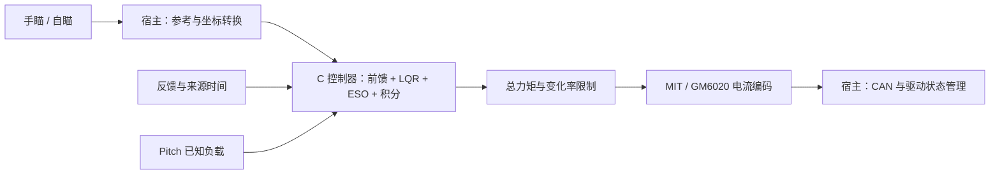

# RoboMaster 云台控制器 · LQR + ESO

[](https://github.com/LYHrmer/robomaster-gimbal-lqr-eso/actions/workflows/ci.yml)
[](include/yaw_controller.h)
[](LICENSE)

**面向 STM32 的 C11 云台控制器库，适配 DM4310 MIT 与 GM6020 电流模式，支持 Yaw / Pitch。**

输入位置、速度、加速度参考和反馈，输出电机总力矩；通过协议适配层接入已有 CAN 任务。手瞄与自瞄共用控制内核，Python 用于电脑端设计和仿真。

[快速开始](docs/quickstart.md) · [选择电机](#选择电机) · [STM32 接入](docs/stm32_integration.md) · [辨识与整定](docs/system_identification.md) · [验证结果](#验证结果怎么读) · [文档导航](docs/README.md)

> **当前状态：软件验证阶段。** 已有真实 C 仿真、故障回归和 Cortex-M4F 编译检查；尚无本项目的电机实测数据，不提供直接烧录的整车固件。仓库参数是仿真示例，需要按实际机构辨识和标定。

## 项目提供什么

控制结构为 **动力学前馈 + 离散 LQR 反馈 + 残余扰动 ESO + 可选抗饱和积分**：前馈补偿已知模型，LQR 根据跟踪误差产生反馈，ESO 估计并补偿剩余扰动。原理与离散实现见 [控制设计](docs/control_design.md)。

| 能力 | 当前范围 |
| --- | --- |
| Yaw | 连续角度控制；提供单圈方向目标的最近等价圈助手 |
| Pitch | 独立的重力倾角、机械关节角与行程检查；重力前馈纳入总力矩限制和抗饱和 |
| 手瞄 / 自瞄 | 上层统一生成参考与来源时间，接入同一控制器；模式管理由宿主工程负责 |
| 实时 C 内核 | 静态状态、无动态分配、无 HAL / RTOS 依赖；检查实际周期、数据年龄和异常数值 |
| 电机与示例 | 两种协议适配、独立静态库、STM32 周期调用示例 |
| 在线参数估计（实验） | 独立 C RLS 只输出候选参数，默认不构建；未自动更新控制器 |
| 多轴基础 | 每关节独立状态；**大 yaw → 小 yaw → pitch 的协调层与耦合闭环尚未实现** |

本库主要提供控制算法和接口。机械坐标转换、整车任务、驱动使能和唯一 CAN 发送者由已有工程接入；建议沿用 [RoboMaster 官方例程的分层方式](docs/opensource_integration_notes.md)。

## 选择电机

两种电机使用相同控制核心，区别在参数与力矩编码。先确认自己的驱动模式，再进入对应说明。

| | [DM4310 MIT 版 →](variants/dm4310/README.md) | [GM6020 电流版 →](variants/gm6020/README.md) |
| --- | --- | --- |
| 命令方式 | MIT 纯力矩，`Kp=Kd=0` | 已确认开启的电流模式 |
| 协议适配 | [dm_mit.c](src/dm_mit.c) | [gm6020.c](src/gm6020.c) |
| 必须核对 | 实际 `PMAX / VMAX / TMAX`、设备 ID 和应用力矩上限 | 固件与电流环配置、分组与槽位；使用 `0x1FE / 0x2FE` |
| 参数示例 | [Yaw](variants/dm4310/simulation_config.h) · [Pitch](variants/dm4310/pitch_simulation_config.h) | [Yaw](variants/gm6020/simulation_config.h) · [Pitch](variants/gm6020/pitch_simulation_config.h) |

DM4310 当前实现 MIT 通道，未实现一拖四模式。GM6020 传统电压帧 `0x1FF / 0x2FF` 与这里的电流接口不同；详细版本要求见 [GM6020 接入说明](docs/gm6020_integration.md)。所有示例配置均为 **`simulation_only`**，不能直接视作上机参数。

## 先在电脑上跑通

以下为 Linux 主机测试，只需 C 编译器、CMake ≥ 3.16 和数学库；不需要电机、CAN 设备或 Python。

```bash
git clone https://github.com/LYHrmer/robomaster-gimbal-lqr-eso.git
cd robomaster-gimbal-lqr-eso
cmake -S . -B build -DCMAKE_BUILD_TYPE=Release
cmake --build build --parallel
ctest --test-dir build --output-on-failure
```

预期 **7 个 CTest 全部通过**。这一步生成的是主机测试程序和库；STM32 目标编译需要对应的 ARM 工具链。

接下来按目的选择：

- **看两种电机的仿真曲线**：[安装 Python 依赖并运行实验](docs/quickstart.md)。示例将新结果写到 `build/` 下。
- **接入自己的 STM32 工程**：[周期示例与回调接口](docs/stm32_integration.md)，再核对所选电机协议。
- **核对“优化”是否成立**：先看下面的结果口径，再按 [逐步复现实验](docs/quickstart.md) 运行固定原版 C 对照。

## 模型辨识与参数整定

先校准力矩标度、时序和机构坐标，再估计每轴的惯量、阻尼、摩擦与 Pitch 重力。现有 LQR 工具可接收辨识后的 `J/B/dt`；权重、ESO 带宽和积分仍需经过独立闭环验证。

- [辨识与整定说明](docs/system_identification.md)：数据怎样变成模型，以及哪些工作已经实现。
- [在线 RLS 实验工程](experimental/online_rls/README.md)：纯 C 候选参数估计、独立构建、逐样本合成实验与复现命令。
- [RLS 数值验证与反例](results/online_rls/README.md)：同时保留正确数据下的参数恢复，以及噪声、时序错位和标度错误造成的偏差。

RLS 是默认关闭的研究组件，不改变手瞄/自瞄控制链。完整实测日志前端、实测参数导出、自动整定与运行中增益切换尚未实现；**参数拟合成功不等于控制性能改善**。

## 验证结果怎么读

下面是合成模型中，五个独立留出种子的**平均配对位置 RMSE 变化**；负号表示误差减小。Yaw 主工况为 2 Hz、±5°；Pitch 为中心 +20°、1 Hz、±5°。不同工况及不同基准不能合并成一个“总体提升率”。

| 场景 | 对照口径 | 留出组 RMSE 变化 | 可以得出的结论 |
| --- | --- | ---: | --- |
| DM4310 · Yaw | 原 / 新版相同参数，Ki=0 | **−6.90%**，5/5 改善 | 声明的主工况通过 |
| GM6020 · Yaw | 新版慢积分配置 vs 原版 Ki=0 | **−33.68%**，5/5 改善 | 有配置收益 |
| GM6020 · Yaw | 原 / 新版使用相同积分参数 | **+4.00%** | 未证明新内核精度更高 |
| DM4310 · Pitch | 同 Ki 原版对照，新版开启重力补偿 | **−72.53%**，5/5 改善 | 开发组与留出组均通过 |
| GM6020 · Pitch | 同 Ki 原版对照，新版开启重力补偿 | **−2.94%**，4/5 改善 | **开发组未通过，完整验收仍失败** |

**这些结果不代表所有工况或实机都更好。** GM6020 的 Yaw 收益需要区分配置与内核；Pitch 总验收字段仍为 `all_primary_acceptance_passed: false`。CI 检查软件正确性、实验有效性及声明的部分性能门槛，绿色状态不等于所有性能验收通过。

| 想核对什么 | 证据入口 |
| --- | --- |
| Yaw 的改善、归因与退化工况 | [Yaw 验证报告](docs/validation_report.md) · [两电机曲线与数据](results/motor_profiles/README.md) |
| Pitch 的重力开关对照和未通过项 | [Pitch 验证报告](docs/pitch_validation.md) · [曲线与原始指标](results/pitch/README.md) |
| NaN、降额、异常周期、陈旧反馈 | [原版 / 新版缺陷回归](docs/regression_evidence.md) |
| 参数失配、延迟和数值可信度 | [鲁棒性](docs/robustness.md) · [积分步长核验](docs/integration_convergence.md) |
| 实验模型和参数从哪里来 | [仿真假设](assumptions.md) · [参数来源](docs/parameter_sources.md) |

早期 7 N·m 挑战条件下的 [原版直接对照](results/upstream_comparison/README.md) 与 [新版 ESO 消融](results/README.md) 单独保留；它们不是两种电机主工况，也不是论坛实验的逐点复现。

## 控制链与代码入口



| 从哪里读代码 | 作用 |
| --- | --- |
| [yaw_controller.h](include/yaw_controller.h) / [yaw_controller.c](src/yaw_controller.c) | 单轴核心：初始化、周期计算、复位和在线力矩降额 |
| [gimbal_controller.h](include/gimbal_controller.h) / [gimbal_controller.c](src/gimbal_controller.c) | Pitch 的重力、机械关节范围和负载历史 |
| [gimbal_coordinates.h](include/gimbal_coordinates.h) | 连续角度与单圈方向目标的接口约定 |
| [STM32 周期示例](examples/stm32/gimbal_periodic.c) / [回调定义](examples/stm32/gimbal_periodic.h) | 反馈快照、实际 dt、力矩提交和停止请求 |
| [DM4310 参数目录](variants/dm4310/README.md) / [GM6020 参数目录](variants/gm6020/README.md) | 两电机的 Yaw / Pitch 仿真参数示例与移植文件 |
| [仿真说明](docs/simulation.md) / [tests](tests) | 真实 C 调用、合成被控对象、接口和回归测试 |

接入时统一使用 **rad、rad/s、rad/s²、N·m、s**。核心接收连续角度，数据年龄取自真实来源时间；首次有效周期输出零，故障锁存后需显式复位。保留 `isfinite()` 检查，禁止 `-ffast-math / -Ofast`。故障零力矩不等于 Pitch 的机械保持，具体要求见 [STM32 接入](docs/stm32_integration.md) 和 [Pitch 接入](docs/pitch_integration.md)。

更多原理、移植和复现文档已按阅读目的整理在 **[文档导航](docs/README.md)**。三轴扩展的职责与当前边界见 [多轴接入](docs/multiaxis_integration.md)。

## 来源与许可

控制思路参考 Combat 战队的 [LamdaDay/YAW_Auto_Controller](https://github.com/LamdaDay/YAW_Auto_Controller/tree/665c5b4ab1067d6cb63122c120822f27502953e5) 与 [论坛文章](https://bbs.robomaster.com/article/1935544?source=1)。本仓库重新实现控制内核，保留来源归属；差异见 [原代码分析](docs/original_code_review.md)。

新写的源码、文档与合成仿真采用 [MIT License](LICENSE)。固定原版源码由脚本下载到忽略目录，仅用于比较；外部原码与手册不随本仓库重新授权或打包。
