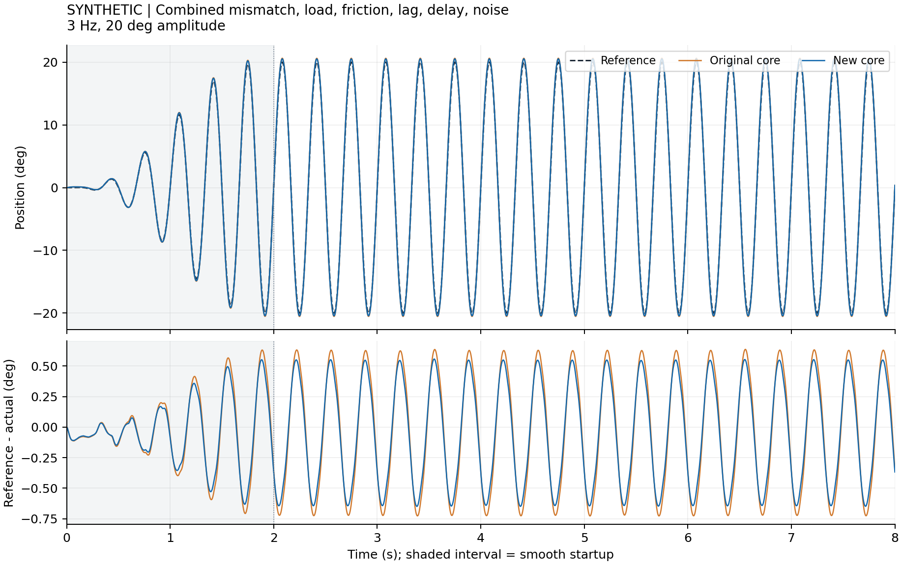
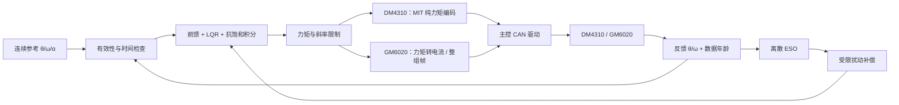

# RoboMaster 云台 LQR–ESO：GM6020 / DM4310

面向 GM6020 与达妙 DM4310 的 **Yaw / Pitch 控制器库**，共用 C11 控制内核。控制结构为 **动力学前馈 + 离散 LQR 反馈 + 残余扰动 ESO + 可选抗饱和积分**。手瞄、自瞄都可由上层生成位置/速度/加速度参考后接入同一控制器。当前完成软件验证，尚无本项目的电机实测数据。

Pitch 增加独立重力角、机械关节角/边界，以及与 ESO 对齐的已知负载前馈；Yaw 提供连续角与最近等价圈参考助手。每个关节独立分配状态，可实例化三个关节，但**没有验证串联三轴的耦合控制性能**。参考分配与关节动力学边界见 [多轴接入](docs/multiaxis_integration.md)。

方案参考 [LamdaDay/YAW_Auto_Controller](https://github.com/LamdaDay/YAW_Auto_Controller) 及 [Combat 战队论坛文章](https://bbs.robomaster.com/article/1935544?source=1)。本仓库重新实现控制内核，保留来源归属；详细解读与区别见 [原代码分析](docs/original_code_review.md)。



图中直接调用固定版本的**原版 C 与新版 C**，使用相同参数和合成被控对象。此图采用最初的 7 N·m 挑战条件；按两种电机规格设置的限额和协议量化另做验证。正弦轨迹是本项目构造的测试输入，论坛截图中的视觉参考并非相同正弦，不能把它们视为原实验逐点复现。

## 改进了什么

| 环节 | 本版实现 | 验证方式 |
| --- | --- | --- |
| ESO 离散计算 | 预测—校正，冻结输入模型下误差极点为 `exp(-ωₒ·dt)` 三重根 | 极点核验、实际 C 闭环仿真 |
| 异常输入/调度 | 检查 NaN、Inf、数据年龄和真实 dt；故障锁存、软件零输出 | 输入异常与复位回归 |
| 力矩限制 | 最终硬限幅优先，支持在线降额；故障输出优先于 slew | 5→1 N·m 降额测试 |
| 积分恢复 | 对最终命令反算抗饱和，并限制积分力矩 | 执行器持续受限测试 |
| 扰动补偿 | 扰动估计、补偿幅值和补偿变化率分别受限 | 扰动保持、参数失配、噪声仿真 |
| 参数设计 | 精确 ZOH 模型 + 离散 Riccati 方程，输出离散极点 | `tools/tune_lqr.py` |
| DM4310 接口 | MIT 纯力矩编码、反馈解析、量化与 ID 检查 | 超过 2 万个协议量化输入测试 |
| GM6020 接口 | 新固件电流模式、转矩常数换算、组帧与反馈解析 | 电流映射、分组、越界与模式确认测试 |
| Pitch 已知负载 | 重力加入总力矩限制/抗饱和之前，ESO 扣除上一周期模型负载 | 非零姿态保持、重力开关对照、载荷失配与行程边界 |
| 轴实例与角度 | 独立状态，单圈方向目标提升到最近连续圈 | ±180° 跨界、三实例状态隔离；不代表耦合三轴验证 |

去掉了原方案中额外的测量力矩偏置积分环。电机力矩反馈的比例、符号和时间对齐尚未在本装置上验证，先用可单独关闭的残余扰动补偿，减少需要同时调节的环节。没有把原偏置环笼统判为“正反馈”。

有限性检查是接口契约的一部分，源码会拒绝 `-ffast-math` 构建，避免编译优化消掉 NaN/Inf 检查。

## 在电脑上运行

已验证 Linux、GCC 11、CMake 3.22、Python 3.10。控制内核只依赖 C 标准库和 `libm`，不需要 MATLAB、ROS、CAN 设备或 GPU。

```bash
git clone https://github.com/LYHrmer/robomaster-gimbal-lqr-eso.git
cd robomaster-gimbal-lqr-eso
cmake -S . -B build -DCMAKE_BUILD_TYPE=Release
cmake --build build -j
ctest --test-dir build --output-on-failure

python3 -m venv .venv
.venv/bin/python -m pip install -r requirements.txt
.venv/bin/python -m unittest discover -s tests -p 'test_*.py'
.venv/bin/python tools/tune_lqr.py
.venv/bin/python sim/run_benchmarks.py
```

输出在 `results/`：PNG、SVG、完整 3 Hz 轨迹 CSV、参数、软件版本、随机种子和源文件哈希。参数口径见 [assumptions.md](assumptions.md)，执行时序与自定义仿真见 [仿真说明](docs/simulation.md)。本机预装科学计算包存在两套版本，因此本次实际运行使用 `python3 -s`；上面的独立虚拟环境用于避免混用。

启用内存与未定义行为检查：

```bash
cmake -S . -B build-sanitize -DCMAKE_BUILD_TYPE=Debug -DYAW_SANITIZERS=ON
cmake --build build-sanitize -j
ctest --test-dir build-sanitize --output-on-failure
```

## 如何判断优化是否成立

两电机的 **Yaw** 预定主工况 **2 Hz、±5°** 已通过开发组和独立验证组验收。下表是未参与选参的五个验证种子的平均配对 RMSE 变化；最大误差均值下降，力矩 RMS 未增加，均无故障、未达到力矩硬上限或触发速度包络限制。力矩变化率限制仍可能生效。

| 版本 | 对照口径 | 验证组 RMSE 改善 |
| --- | --- | ---: |
| DM4310 MIT | 原/新版相同参数，积分关闭 | **6.90%**，5/5 改善 |
| GM6020 电流 | 新版慢积分配置对原 Ki=0 基准 | **33.68%**，5/5 改善 |

**GM 收益主要来自配置。** 新版相对同积分参数原版的验证组平均配对 RMSE 高 4.00%，因此没有证明 GM 新内核本身精度更高。完整归因、独立步长核验、退步工况和可执行验收见 [最终报告](docs/validation_report.md)。

**Pitch 单独验证，不能沿用上表收益。** 主工况为中心 +20°、1 Hz、±5°，保持同 Ki 原版对照并增加新版重力关闭对照。五个留出种子中，DM4310 相对原版平均配对 RMSE 降低 **72.53%（5/5）**，GM6020 降低 **2.94%（4/5）**。但是 GM 开发组仅 1/3 改善、未通过预定门槛，因此 Pitch 总验收字段仍为 `all_primary_acceptance_passed: false`；不能称为两电机 Pitch 均已稳定改善。错误重力符号、高延迟和不可支撑载荷的退化全部保留，见 [Pitch 完整验证](docs/pitch_validation.md)。

同时看三组证据：

1. **原版 vs 新版**：同参考、被控对象、LQR 增益、限幅和随机噪声，直接调用两份真实 C 内核；[原版对照结果](results/upstream_comparison/README.md)。
2. **缺陷回归**：原版固定提交下的异常输入、降额、异常周期和陈旧反馈，与新版契约逐项比较；[回归证据](docs/regression_evidence.md)。
3. **新版 ESO 消融**：同一新版中只改变补偿系数；[完整六场景表](results/README.md)。

**原版直接对照**中，综合扰动 3 Hz ±20° 的位置 RMSE 从原版 `0.4810°` 降为新版 `0.4225°`，降低约 **12.2%**。综合扰动 1 Hz 的改善只有约 1.1%，5 Hz 饱和场景基本没有改善。

**新版内部消融**中，综合扰动 3 Hz 的 RMSE 从关闭 ESO 的 `0.6863°` 降为开启后的 `0.4225°`；名义 3 Hz 场景略有退步。消融收益不能记为相对原版的提升。全部结果保留，不能把单场景收益推广为全面性能提升。

按电机规格加入力矩/速度约束及模型失配后的补充验证，见 [参数来源](docs/parameter_sources.md) 和 [鲁棒性验证](docs/robustness.md)。

运行固定原版对照：

```bash
.venv/bin/python tools/fetch_upstream.py
.venv/bin/python tests/test_upstream_regressions.py --report results/upstream_regressions.json
.venv/bin/python sim/compare_upstream.py
```

原版文件按固定提交和 SHA256 获取到被忽略的 `build/upstream/`。离线可用 `tools/fetch_upstream.py --source-dir /path/to/YAW_Auto_Controller`，不修改原仓库，也不把外部源码纳入本仓库发布文件。

## 选择电机版本

| 项目 | [DM4310 版](variants/dm4310/README.md) | [GM6020 版](variants/gm6020/README.md) |
| --- | --- | --- |
| 命令通道 | MIT 模式 `Kp=Kd=0`，力矩 `t_ff` | 已确认开启的电流模式，`I=τ/Kt` |
| 控制帧 | 设备配置的 CAN ID | `0x1FE` / `0x2FE` 分组 |
| 单位换算 | 由实际 `PMAX/VMAX/TMAX` 映射 | `Kt=0.741 N·m/A` 参考值；±16384 对应 ±3 A |
| Yaw / Pitch 仿真配置 | `dm4310_24v.json` / `dm4310_24v_pitch.json` | `gm6020_current.json` / `gm6020_current_pitch.json` |
| 移植文件 | 控制核心 + 可选 Pitch/角度适配 + `dm_mit.c/.h` | 控制核心 + 可选 Pitch/角度适配 + `gm6020.c/.h` |
| 独立构建产物 | `libgimbal_dm4310.a` | `libgimbal_gm6020.a` |

GM6020 官方 v1.4 手册要求固件至少 `1.0.11.2`，使用至少 `2.7` 的 Assistant 开启电流环。传统电压控制帧 `0x1FF/0x2FF` 不与电流帧混用。本版不会把 N·m 直接换成传统电压指令。

四个轴/电机 JSON 都标有 `simulation_only: true`，生成的 Yaw/Pitch C 参数示例也标有同一边界。它们使用声明的参考负载以便受控比较，不代表不同电机的“通用整车参数”。电机协议量化参与 [Yaw 两电机仿真](docs/motor_profiles.md)和 [Pitch 仿真](docs/pitch_validation.md)。

```bash
.venv/bin/python tools/generate_profile_headers.py --check
.venv/bin/python sim/run_sensitivity.py
.venv/bin/python sim/run_motor_profiles.py
.venv/bin/python tools/check_performance.py
.venv/bin/python tools/check_integration_convergence.py
.venv/bin/python sim/analyze_local_dynamics.py
.venv/bin/python sim/run_pitch_profiles.py --phase full
```

Pitch 脚本默认必须通过实验有效性检查，包括源码运行中不变和独立步长细化，但会保存性能失败结果。`--require-primary-improvement` 仍要求开发与留出组全部通过，当前会因 GM 开发组失败返回非零。CI 完整重跑 Pitch，并仅对预定留出组沿用原性能阈值；CI 通过不等于总性能验收通过，详见 [验收报告](docs/validation_report.md)。

## 代码入口与移植

| 文件 | 作用 |
| --- | --- |
| `include/yaw_controller.h`、`src/yaw_controller.c` | 实时控制内核，静态分配状态，无 I/O |
| `include/gimbal_controller.h`、`src/gimbal_controller.c` | 单轴 Pitch 适配：独立重力角/关节边界、负载历史 |
| `include/gimbal_coordinates.h`、`src/gimbal_coordinates.c` | `gimbal_angle_near()`，将方向目标提升到最近连续圈 |
| `include/dm_mit.h`、`src/dm_mit.c` | MIT 协议；不含 CAN 驱动和自动使能 |
| `include/gm6020.h`、`src/gm6020.c` | GM6020 电流通道适配；保留整组指令语义 |
| `tools/tune_lqr.py` | 由自己的 `J/B/dt/Q/R` 计算增益 |
| `sim/c_core.py`、`sim/run_benchmarks.py` | C 绑定和合成被控对象 |
| `tests/` | 控制器、协议、仿真数学与上游回归 |

周期调用关系：



初始化用 `yaw_controller_init()`，每周期调用 `yaw_controller_step()`。第一次有效反馈返回 `YAW_WARMUP`、输出零；异常返回具体故障并锁存。故障排除后由上层明确调用 `yaw_controller_reset()`，下一有效周期重新同步状态。硬限幅可以通过 `yaw_controller_set_torque_limit()` 收紧。

Pitch 可用 `gimbal_controller_init()/step()`，提供同一快照中的世界反馈、机械关节姿态与重力角；复杂重力曲线或经验证的耦合模型可由宿主计算，通过 `yaw_controller_step_with_load()` 传入当前及上一周期已知负载。重力模型和机械零点需要分别标定，见 [Pitch 接入](docs/pitch_integration.md)。手瞄/自瞄区别保留在上层参考生成与模式切换中，不需要另写一套电机驱动。

所有角度使用**连续展开的输出轴弧度**，核心不自动选择最短角路径；多圈零点、参考连续化和时间戳由调用方处理。`feedback.age_s` 必须来自最近有效接收时刻，不能每次读缓存就置零。

接入达妙时使用 MIT 纯力矩通道（`Kp=Kd=0`），控制器输出作为 `t_ff`。协议 `TMAX`、电机额定/峰值能力、实验允许力矩是不同参数。编码成功也不等于允许使能；上层需处理驱动状态、失能和通信看门狗。具体见 [DM4310 接入说明](docs/dm4310_integration.md)。

最终部署目标是 **STM32 上的 C 控制器**，仓库以 RoboMaster 官方开发板例程为主要接入参考。[官方源码接入位置](docs/opensource_integration_notes.md)、[STM32 接入说明](docs/stm32_integration.md)和 [Yaw/Pitch C 周期示例](examples/stm32/gimbal_periodic.c)说明任务、真实周期、反馈快照与 CAN 回调的对接方式；原 [Yaw 周期接口](examples/stm32/yaw_periodic.c)继续兼容。Python 仅用于电脑端验证。另提供 Cortex-M4F 的 [ARM 编译检查](tools/check_arm_build.py)。

公共库不绑定某一台整车的 STM32 型号和机械负载，不包含可直接烧录的板级固件。按 [实验步骤与记录格式](docs/experiment_plan.md) 接入自己的硬件，并替换仿真假设参数。

## 来源与许可

- 控制思路和原代码阅读：戴子轩 / Combat 战队，固定参考提交 [`665c5b4`](https://github.com/LamdaDay/YAW_Auto_Controller/tree/665c5b4ab1067d6cb63122c120822f27502953e5)。
- 协议依据：达妙官方手册与官方 SDK，链接及版本见接入说明。
- 新写的源码、文档与合成仿真按 [MIT License](LICENSE) 提供。下载到忽略目录的原版源码及外部手册不在本许可证授权范围内；仓库不重新打包它们。
