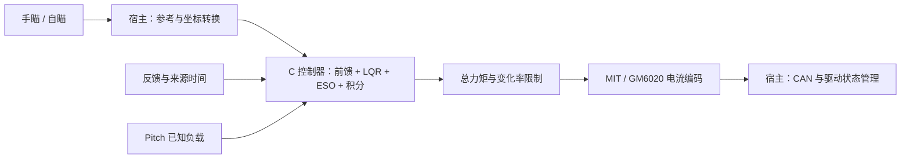

# 云台控制器 · LQR + ESO

[](https://github.com/LYHrmer/gimbal-lqr-eso/actions/workflows/ci.yml)
[](include/yaw_controller.h)
[](LICENSE)

**面向 STM32 的 C11 云台控制器库，适配 DM4310 MIT 与 GM6020 电流模式，支持 Yaw / Pitch。**

输入位置、速度、加速度参考和反馈，输出电机总力矩；通过协议适配层接入已有 CAN 任务。手瞄与自瞄共用控制内核，Python 用于电脑端设计和仿真。

**准备实机辨识：** [GM6020 怎么辨识 →](docs/gm6020_identification.md) · [DM4310 怎么辨识 →](docs/dm4310_identification.md)

[1. 选择电机](#选择电机) → [2. 跑 C 测试](#先在电脑上跑通) → [3. 辨识参数](#模型辨识与参数整定) → [4. 接入 STM32](#接入-stm32) → [5. 核对收益](#验证结果怎么读)

> **GM6020 Pitch 已在用户整机上实际可用（2026-10-07 用户确认）。** 已核查的整机归档使用 C++ 下游实现；公开 C 内核已有真实 C 仿真、故障回归和 Cortex-M4F 编译检查，尚无针对该内核的实机原始日志或硬件 A/B 报告。[实际移植核查](docs/porting_review_20261007.md)记录了本次接入改进；历史材料另见[早期测试回顾](docs/lqr-leso-testing.md)和[在线辨识与实机视频](docs/gm6020_pitch_identification_followup.md)。示例参数仍需按实际机构辨识和标定。

全部资料见 [文档导航](docs/README.md)；最近的可复现问题、修复和回归见 [实机前软件检查](docs/prehardware_review.md)。

新增 [14 张部分实机调试截图](docs/hardware_debug_screenshots_20261007.md)：Yaw 的 Q/角速度反馈/加速度前馈对照，以及 Pitch 小幅响应和姿态估计对比，保留原图与配置注释。

## 项目提供什么

控制结构为 **动力学前馈 + 离散 LQR 反馈 + 残余扰动 ESO + 可选抗饱和积分**：前馈补偿已知模型，LQR 根据跟踪误差产生反馈，ESO 估计并补偿剩余扰动。原理与离散实现见 [控制设计](docs/control_design.md)。

| 组成 | 当前范围与职责 |
| --- | --- |
| 实时 C 内核 | 面向 STM32；静态状态、无动态分配、无 HAL / RTOS 依赖，检查实际周期、数据年龄和异常数值 |
| Yaw / Pitch | Yaw 使用连续角度；Pitch 分别处理重力倾角、机械关节角与行程，重力补偿纳入总力矩限制和抗饱和 |
| 电机适配与示例 | 两种协议适配、独立静态库、STM32 周期调用示例 |
| 宿主工程接入 | 已有工程负责坐标转换、手瞄/自瞄参考、模式管理、驱动使能和唯一 CAN 发送者 |
| 在线 RLS 实验 | 独立 C 估计器只输出候选参数，**默认不构建、不更新控制器**；数据窗口与激励判断目前在 Python 中 |
| 三轴扩展计划 | 已有独立轴实例与角度助手；**大 Yaw → 小 Yaw → Pitch 协调层及耦合闭环尚未实现** |

仓库提供控制器库及接入示例，不包含直接烧录的整车固件；建议沿用 [RoboMaster 官方例程的分层方式](docs/opensource_integration_notes.md)。

## 选择电机

两种电机使用相同控制核心，区别在参数与力矩编码。先确认自己的驱动模式，再进入对应说明。

| | [DM4310 MIT 版 →](variants/dm4310/README.md) | [GM6020 电流版 →](variants/gm6020/README.md) |
| --- | --- | --- |
| 命令方式 | MIT 纯力矩，`Kp=Kd=0` | 已确认开启的电流模式 |
| 协议适配 | [dm_mit.c](src/dm_mit.c) | [gm6020.c](src/gm6020.c) |
| 必须核对 | 实际 `PMAX / VMAX / TMAX`、设备 ID 和应用力矩上限 | 固件与电流环配置、分组与槽位；使用 `0x1FE / 0x2FE` |
| 参数示例 | [Yaw](variants/dm4310/simulation_config.h) · [Pitch](variants/dm4310/pitch_simulation_config.h) | [Yaw](variants/gm6020/simulation_config.h) · [Pitch](variants/gm6020/pitch_simulation_config.h) |

DM4310 当前实现 MIT 通道，未实现一拖四模式。GM6020 传统电压帧 `0x1FF / 0x2FF` 与这里的电流接口不同；详细版本要求见 [GM6020 接入说明](docs/gm6020_integration.md)。所有示例配置均为 **`simulation_only`**，不能直接视作上机参数。

## 先在电脑上跑通

以下为 Linux 主机测试，只需 C 编译器、CMake ≥ 3.16 和数学库；不需要电机、CAN 设备或 Python。

```bash
git clone https://github.com/LYHrmer/gimbal-lqr-eso.git
cd gimbal-lqr-eso
cmake -S . -B build -DCMAKE_BUILD_TYPE=Release
cmake --build build --parallel
ctest --test-dir build --output-on-failure
```

预期 **7 个 CTest 全部通过**。这一步生成的是主机测试程序和库；STM32 目标编译需要对应的 ARM 工具链。

Python 环境、两种电机的仿真和固定原版 C 对照命令见 [快速开始](docs/quickstart.md)。其中的命令将新结果写入 `build/`，便于与已发布结果比较。

## 模型辨识与参数整定

先校准力矩标度、时序和机构坐标，再估计每轴的惯量、阻尼、摩擦与 Pitch 重力。现有 LQR 工具可接收辨识后的 `J/B/dt`；权重、ESO 带宽和积分仍需经过独立闭环验证。

[辨识与整定总览](docs/system_identification.md) 解释数据怎样变成模型，以及哪些工作已经实现。实机操作先选下面对应的一行：

| 使用哪种电机 | 从哪里开始 | 数据与标度重点 |
| --- | --- | --- |
| **GM6020 电流模式** | [6020 辨识步骤](docs/gm6020_identification.md) → [Rudder 数据模板](examples/gm6020_rudder_template/README.md) | 电流反馈原码；先核准反馈比例和转矩常数，命令比例不能直接代用 |
| **DM4310 MIT 模式** | [4310 辨识步骤](docs/dm4310_identification.md) → [MIT 数据模板](examples/dm4310_identification_template/README.md) | 位置/速度/转矩回读；先核准 PMAX/VMAX/TMAX，转矩回读不等于轴端实测 |

两条路径都按 **核准信号与标度 → Yaw/Pitch 分步辨识 → 独立验证 → 整定控制器** 进行。Rudder 模板专门对应已核对的两轴 GM6020 工程；其他宿主需重新映射取样点。模板的字段来源见 [实机数据留存](docs/test_data_recording.md)。

[在线 RLS 实验](experimental/online_rls/README.md) 可先验证 C 候选参数递推；[数值验证与反例](results/online_rls/README.md) 同时保留噪声、时序错位和标度错误造成的偏差。

完整实测日志前端、实测参数导出、自动整定与运行中增益切换尚未实现。辨识得到的候选参数仍需独立轨迹和闭环检验：**参数拟合成功不等于控制性能改善**。

## 接入 STM32

从 [周期示例与回调契约](docs/stm32_integration.md) 开始，按所选电机连接反馈和力矩提交。手瞄/自瞄在宿主侧统一参考、坐标和来源时间；模式切换与 CAN 调度仍由已有工程负责。

已有 C++17 固件可直接看[实际工程移植步骤](docs/firmware_porting.md)：两行 CMake 接入现有目标、自定义 Pitch 重力曲线入口，以及[空白移植记录](examples/porting_record_template.md)。宿主继续管理自己的曲线、外设和控制任务。



| 从哪里读代码 | 作用 |
| --- | --- |
| [yaw_controller.h](include/yaw_controller.h) / [yaw_controller.c](src/yaw_controller.c) | 单轴核心：初始化、周期计算、复位和在线力矩降额 |
| [gimbal_controller.h](include/gimbal_controller.h) / [gimbal_controller.c](src/gimbal_controller.c) | Pitch 的重力、机械关节范围和负载历史 |
| [gimbal_coordinates.h](include/gimbal_coordinates.h) | 连续角度与单圈方向目标的接口约定 |
| [STM32 周期示例](examples/stm32/gimbal_periodic.c) / [回调定义](examples/stm32/gimbal_periodic.h) | 反馈快照、实际 dt、力矩提交和停止请求 |
| [DM4310 参数目录](variants/dm4310/README.md) / [GM6020 参数目录](variants/gm6020/README.md) | 两电机的 Yaw / Pitch 仿真参数示例与移植文件 |
| [仿真说明](docs/simulation.md) / [tests](tests) | 真实 C 调用、合成被控对象、接口和回归测试 |

接入时统一使用 **rad、rad/s、rad/s²、N·m、s**。首次有效周期输出零，故障锁存后需显式复位；零力矩不能代替 Pitch 的机械保持。编译必须保留有限数检查，禁止 `-ffinite-math-only / -ffast-math / -Ofast`。坐标与重力约定见 [Pitch 接入](docs/pitch_integration.md)，恢复与边界验证见 [实机前软件检查](docs/prehardware_review.md)。

三轴的参考分配、连续角度及宿主职责见 [多轴接入](docs/multiaxis_integration.md)。

## 验证结果怎么读

下面是合成模型中，五个独立留出种子的**平均配对位置 RMSE 变化**；负号表示误差减小。Yaw 主工况为 2 Hz、±5°；Pitch 为中心 +20°、1 Hz、±5°。不同工况及不同基准不能合并成一个“总体提升率”。

| 场景 | 对照口径 | 留出组 RMSE 变化 | 可以得出的结论 |
| --- | --- | ---: | --- |
| DM4310 · Yaw | 原 / 新版相同参数，Ki=0 | **−6.90%**，5/5 改善 | 声明的主工况通过 |
| GM6020 · Yaw | 新版慢积分配置 vs 原版 Ki=0 | **−33.68%**，5/5 改善 | 有配置收益 |
| GM6020 · Yaw | 原 / 新版使用相同积分参数 | **+4.00%** | 未证明新内核精度更高 |
| DM4310 · Pitch | 同 Ki 原版对照，新版开启重力补偿 | **−72.53%**，5/5 改善 | 开发组与留出组均通过 |
| GM6020 · Pitch | 同 Ki 原版对照，新版开启重力补偿 | **−2.94%**，4/5 改善 | 留出组通过；开发组未通过，整体合成验收仍为 `false` |

**这些结果不代表所有工况或实机都更好。** GM6020 的 Yaw 收益需要区分配置与内核。CI 检查软件正确性、实验有效性及声明的部分性能门槛，绿色状态不等于所有性能验收通过。

用户已确认 GM6020 Pitch 的实机可用性；上表保留特定合成模型的验收结果，不能据开发组未通过推断实机不能使用。

| 想核对什么 | 证据入口 |
| --- | --- |
| Yaw 的改善、归因与退化工况 | [Yaw 验证报告](docs/validation_report.md) · [两电机曲线与数据](results/motor_profiles/README.md) |
| Pitch 的重力开关对照和未通过项 | [Pitch 验证报告](docs/pitch_validation.md) · [曲线与原始指标](results/pitch/README.md) |
| NaN、降额、异常周期、陈旧反馈 | [原版 / 新版缺陷回归](docs/regression_evidence.md) |
| 参数失配、延迟和数值可信度 | [鲁棒性](docs/robustness.md) · [积分步长核验](docs/integration_convergence.md) |
| 实验模型和参数从哪里来 | [仿真假设](assumptions.md) · [参数来源](docs/parameter_sources.md) |
| 用户独立实现的下游整机固件（非本仓库内核） | [早期整机测试回顾](docs/lqr-leso-testing.md) · [在线辨识与超调跟进 + 实机视频](docs/gm6020_pitch_identification_followup.md) |

早期 7 N·m 挑战条件下的 [原版直接对照](results/upstream_comparison/README.md) 与 [新版 ESO 消融](results/README.md) 单独保留；它们不是两种电机主工况，也不是论坛实验的逐点复现。

## 来源与许可

控制思路参考 Combat 战队的 [LamdaDay/YAW_Auto_Controller](https://github.com/LamdaDay/YAW_Auto_Controller/tree/665c5b4ab1067d6cb63122c120822f27502953e5) 与 [论坛文章](https://bbs.robomaster.com/article/1935544?source=1)。本仓库重新实现控制内核，保留来源归属；差异见 [原代码分析](docs/original_code_review.md)。

新写的源码、文档与合成仿真采用 [MIT License](LICENSE)。固定原版源码由脚本下载到忽略目录，仅用于比较；外部原码与手册不随本仓库重新授权或打包。
