# GM6020 实机调试图册

[项目首页](../README.md) · [文档导航](README.md) · [Yaw 图组](#yaw) · [Pitch 图组](#pitch) · [原图清单](evidence/gm6020_hardware_debug_20261007/manifest.json)

**14 张原图 · Yaw 7 张 / Pitch 7 张**

点击查看原图，按图号展开记录；默认展示 Yaw 前馈与 Pitch LQG / ESO 图组。

2026-10-07 收录用户提供的部分 MemRW3 实机截图，原图逐字节保留。实际测试日期、对应固件版本及逐样本日志尚未补齐。

用户同时确认 **GM6020 Pitch 已在整机上实际可用**。以下保存的是部分调试过程，不是统一工况下的最终性能验收。

## Yaw：Q、角速度反馈与加速度前馈

用户已确认，`400,1` / `600,2` 是 Q 的两项，**R = 1**，图中角度单位为 **rad**，“速度反馈”指**实测角速度反馈**。目标速度前馈是否启用未说明，须与角速度反馈分别记录。当时的模型、采样周期及实际 K 尚未逐图绑定，不能只由 Q/R 还原上机增益；关闭角速度反馈的组还需记录实际使用的控制律。

下表已分配的参数组均关闭 ESO。ω 反馈指实测角速度反馈，a 前馈指加速度前馈。

| 原图 | Q 对角项 | ω 反馈 | a 前馈 |
| --- | --- | --- | --- |
| [Y01](evidence/gm6020_hardware_debug_20261007/yaw_01.png) | 400, 1 | 关 | 关 |
| [Y02](evidence/gm6020_hardware_debug_20261007/yaw_02.png) | 400, 1 | 开 | 关 |
| [Y03](evidence/gm6020_hardware_debug_20261007/yaw_03.png) | 未分配 | 未分配 | 未分配 |
| [Y04](evidence/gm6020_hardware_debug_20261007/yaw_04.png) / [Y05](evidence/gm6020_hardware_debug_20261007/yaw_05.png) | 600, 2 | 开 | 关 |
| [Y06](evidence/gm6020_hardware_debug_20261007/yaw_06.png) / [Y07](evidence/gm6020_hardware_debug_20261007/yaw_07.png) | 600, 2 | 开 | 开 |

两路角度曲线为 `recepakge.yaw` 与 `gimbal.gimbal_lqr_.yaw_ang_`，误差信号为 `gimbal.err_yaw_`。Y03 原注释为“分割线”，配置不归入前后参数组。

Y01/Y02 中两路曲线有可见相位差；Y04/Y07 中两路波形更接近，但仍有峰值、相位或局部偏差。由于图间中心角、幅值、时间窗口及运行配置并未完整配对，本页不把这种视觉差别换算成误差下降百分比，也不把改善唯一归因于某一个开关。

<strong>Y01 · Y02 / Q = diag(400, 1)，R = 1</strong>

<table>
  <tr>
    <td width="50%" valign="top">
      <strong>Y01 · 无实测角速度反馈</strong> 
      <a href="evidence/gm6020_hardware_debug_20261007/yaw_01.png">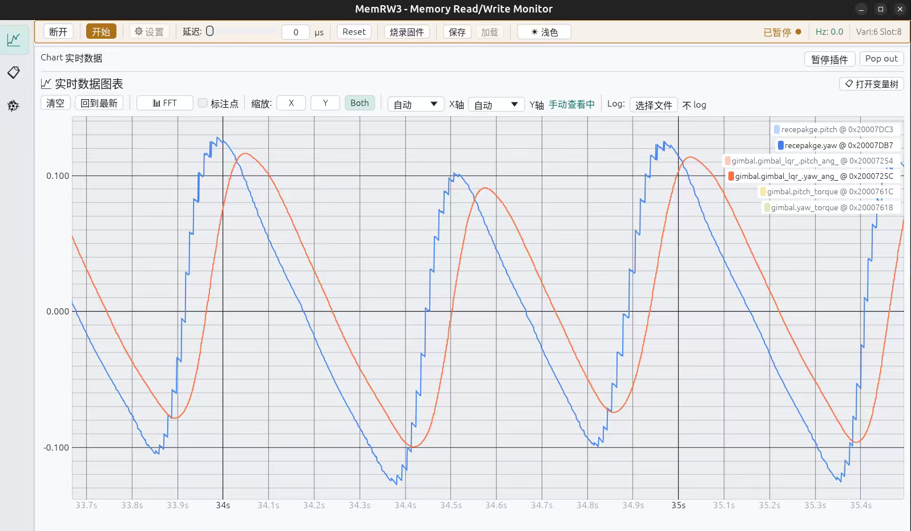</a>
    </td>
    <td width="50%" valign="top">
      <strong>Y02 · 有实测角速度反馈</strong> 
      <a href="evidence/gm6020_hardware_debug_20261007/yaw_02.png">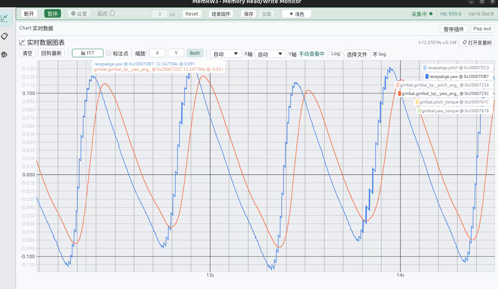</a>
    </td>
  </tr>
</table>

<strong>Y03 / 原注释“分割线”，配置未分配</strong>

<table>
  <tr>
    <td width="100%" valign="top">
      <strong>Y03 · 误差信号</strong> 
      <a href="evidence/gm6020_hardware_debug_20261007/yaw_03.png">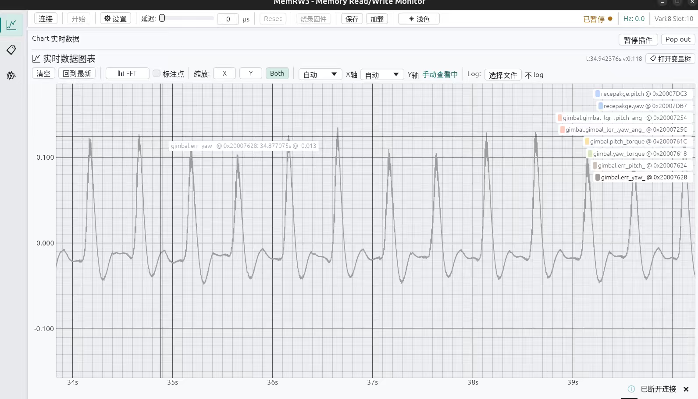</a>
    </td>
  </tr>
</table>

<strong>Y04 · Y05 / Q = diag(600, 2)，无加速度前馈</strong>

<table>
  <tr>
    <td width="50%" valign="top">
      <strong>Y04 · 两路角度曲线</strong> 
      <a href="evidence/gm6020_hardware_debug_20261007/yaw_04.png">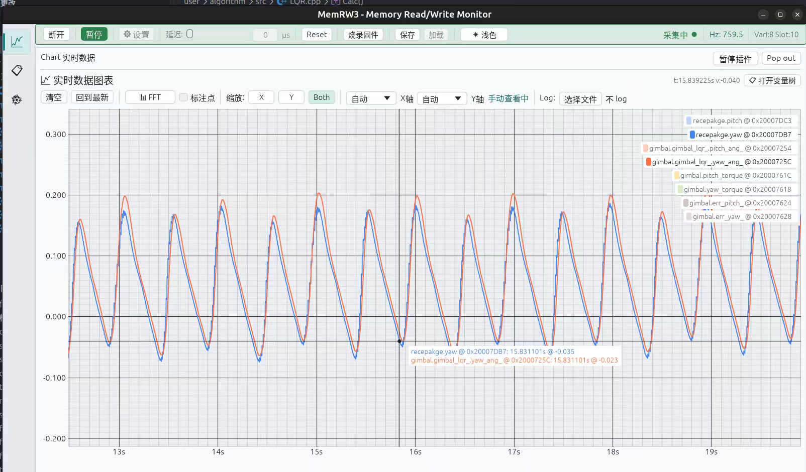</a>
    </td>
    <td width="50%" valign="top">
      <strong>Y05 · 误差信号</strong> 
      <a href="evidence/gm6020_hardware_debug_20261007/yaw_05.png">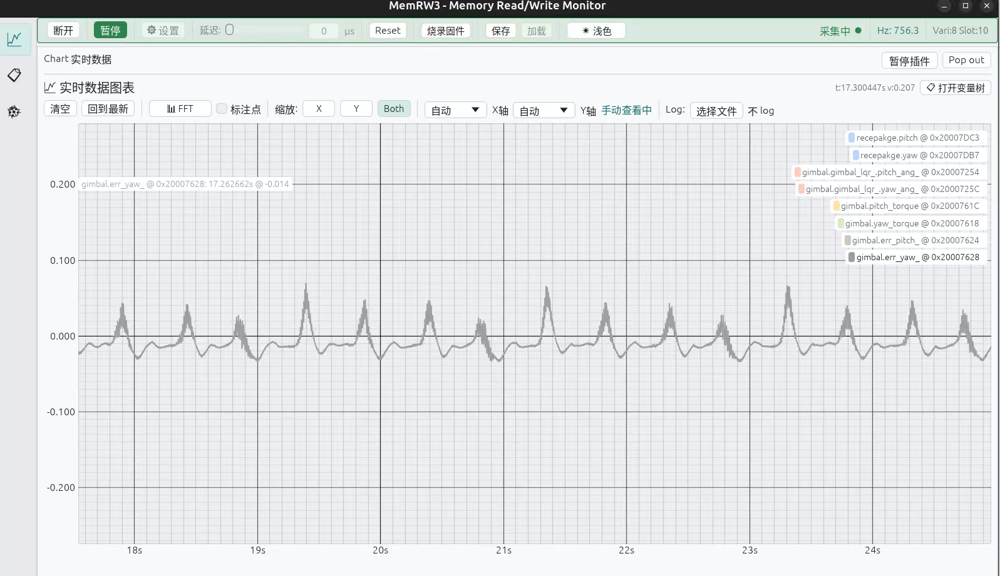</a>
    </td>
  </tr>
</table>

<strong>Y06 · Y07 / Q = diag(600, 2)，有加速度前馈</strong>

<table>
  <tr>
    <td width="50%" valign="top">
      <strong>Y07 · 两路角度曲线</strong> 
      <a href="evidence/gm6020_hardware_debug_20261007/yaw_07.png">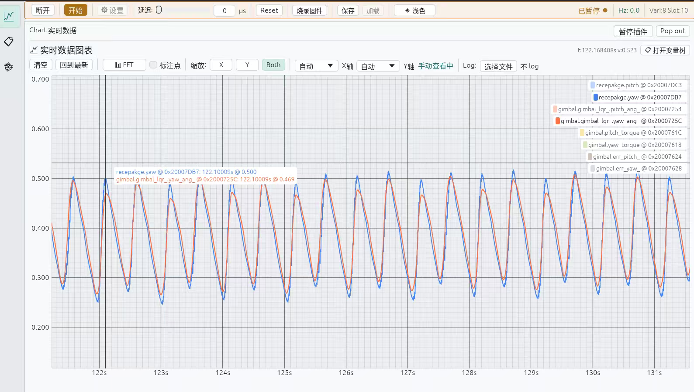</a>
    </td>
    <td width="50%" valign="top">
      <strong>Y06 · 误差信号</strong> 
      <a href="evidence/gm6020_hardware_debug_20261007/yaw_06.png">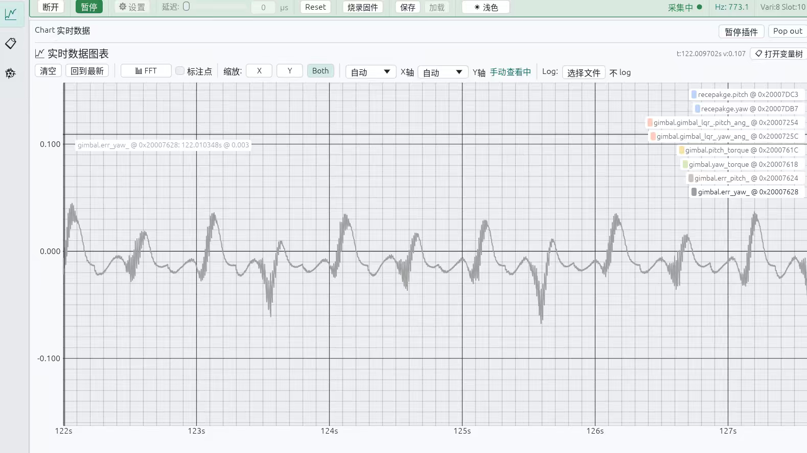</a>
    </td>
  </tr>
</table>

## Pitch：小幅参考响应、姿态估计对比与模式记录

用户确认下列三元组属于 **ESO 参数**，并确认 **LQG = LQR + Kalman 状态估计**。三个 ESO 参数的具体名称、排列顺序、单位，以及 P01–P03 与前两组设置的逐图对应关系尚未明确，按原注释保留。LQG 的具体实现和 Kalman 参数尚未绑定到对应固件版本。

前三张的共同注释为 `100,1000,0.03；60,900,0.08`，逐图对应待确认。

| 原图 | 配置标签 | 记录内容 |
| --- | --- | --- |
| [P01](evidence/gm6020_hardware_debug_20261007/pitch_01.png) | ESO，待配对 | 方波响应，有直流偏移 |
| [P02](evidence/gm6020_hardware_debug_20261007/pitch_02.png) | ESO，待配对 | 两路姿态估计 |
| [P03](evidence/gm6020_hardware_debug_20261007/pitch_03.png) | ESO，待配对 | 参考与反馈，有偏移 |
| [P04](evidence/gm6020_hardware_debug_20261007/pitch_04.png) | 100, 1000, 0.03 | 小幅方波，含时间轴 |
| [P05](evidence/gm6020_hardware_debug_20261007/pitch_05.png) | 100, 2500, 0.03 | 多周期，时间刻度不完整 |
| [P06](evidence/gm6020_hardware_debug_20261007/pitch_06.png) | LQG | 零附近响应，探针断连 |
| [P07](evidence/gm6020_hardware_debug_20261007/pitch_07.png) | LQG + ESO | 零附近响应 |

P01 记录 `set_pitch_` 与内部角度，P03–P07 记录 `pitch_ang_ref_` 与 `pitch_ang_`；可见有限上升时间、偏移或幅值差。P02 的 `INS.Pitch` / `QEKF_INS.Roll` 是姿态估计对比，须补足安装与轴映射后再解释差值；曲线接近不能单独证明绝对精度或已消除机动加速度污染。P06 的探针断连提示属于采集上下文。Pitch 各图单位尚待确认，不统一按 rad 或度换算。

<strong>P01 · P03 / 小幅参考响应，ESO 参数配对待补充</strong>

<table>
  <tr>
    <td width="50%" valign="top">
      <strong>P01 · 参考与内部角度</strong> 
      <a href="evidence/gm6020_hardware_debug_20261007/pitch_01.png">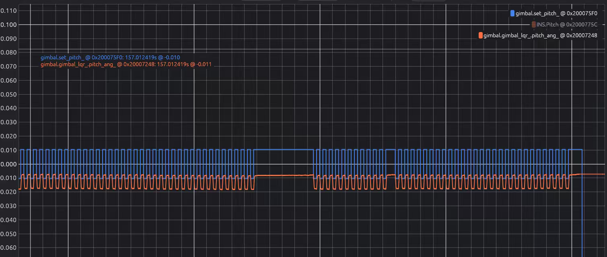</a>
    </td>
    <td width="50%" valign="top">
      <strong>P03 · 参考与反馈</strong> 
      <a href="evidence/gm6020_hardware_debug_20261007/pitch_03.png">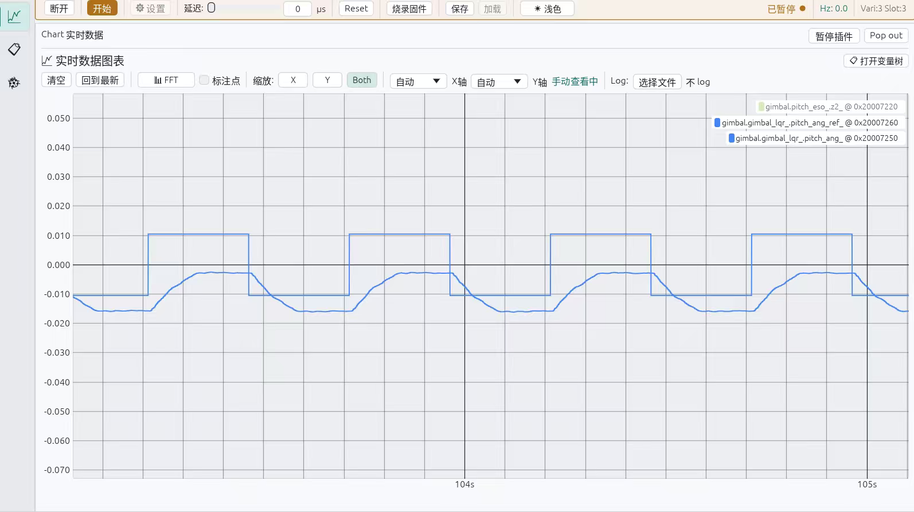</a>
    </td>
  </tr>
</table>

<strong>P02 / INS 与 QEKF 姿态估计对比</strong>

<table>
  <tr>
    <td width="100%" valign="top">
      <strong>P02 · 姿态估计对比</strong> 
      <a href="evidence/gm6020_hardware_debug_20261007/pitch_02.png">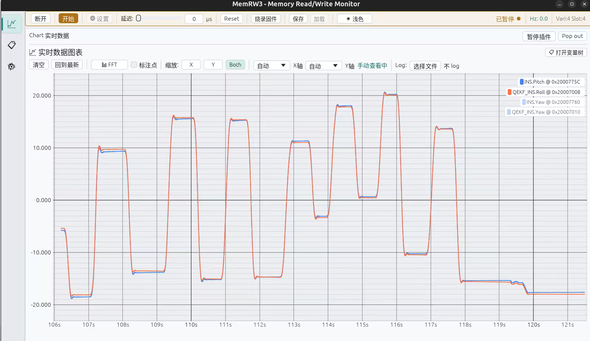</a>
    </td>
  </tr>
</table>

<strong>P04 · P05 / 两组 ESO 参数记录</strong>

<table>
  <tr>
    <td width="50%" valign="top">
      <strong>P04 · 100, 1000, 0.03</strong> 
      <a href="evidence/gm6020_hardware_debug_20261007/pitch_04.png">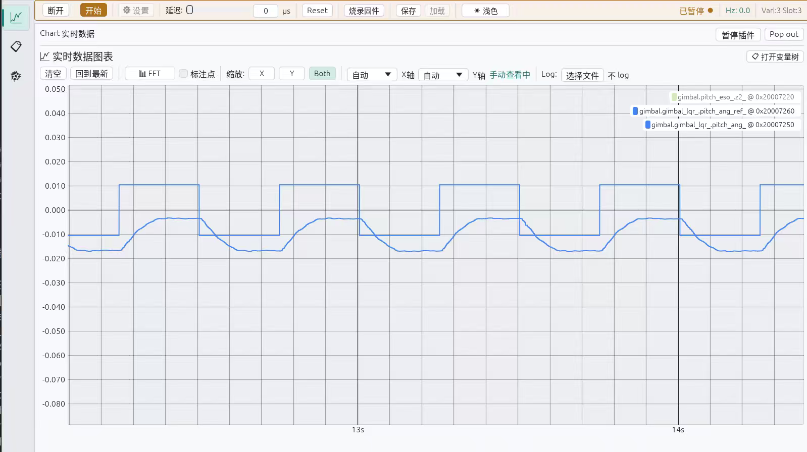</a>
    </td>
    <td width="50%" valign="top">
      <strong>P05 · 100, 2500, 0.03</strong> 
      <a href="evidence/gm6020_hardware_debug_20261007/pitch_05.png">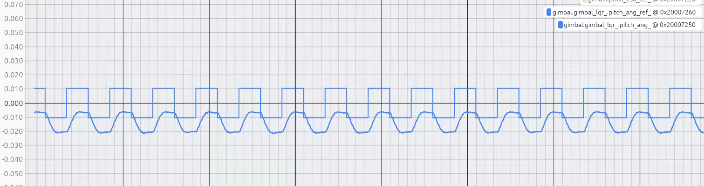</a>
    </td>
  </tr>
</table>

<strong>P06 · P07 / LQG 与 LQG + ESO 记录</strong>

<table>
  <tr>
    <td width="50%" valign="top">
      <strong>P06 · LQR + Kalman</strong> 
      <a href="evidence/gm6020_hardware_debug_20261007/pitch_06.png">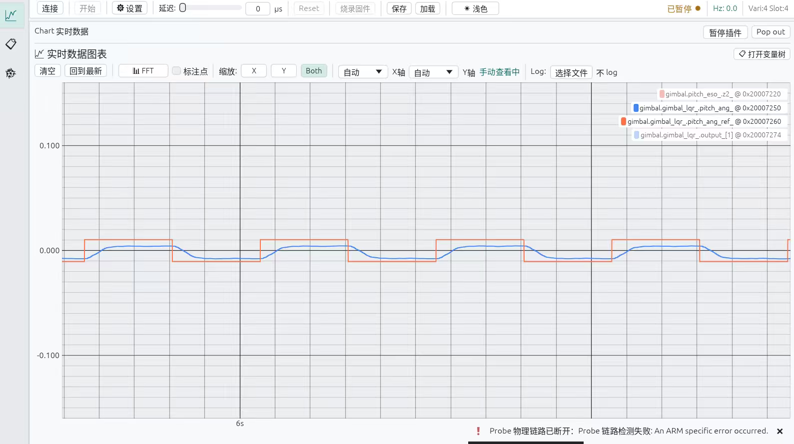</a>
    </td>
    <td width="50%" valign="top">
      <strong>P07 · LQR + Kalman + ESO</strong> 
      <a href="evidence/gm6020_hardware_debug_20261007/pitch_07.png">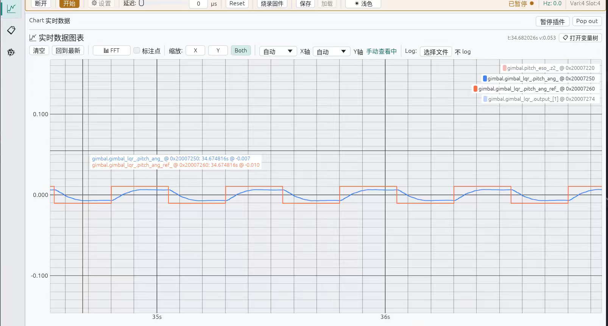</a>
    </td>
  </tr>
</table>

## 已纳入移植记录的经验

1. **分别记录反馈与前馈。** `-Kω·ω` 的实测角速度反馈、`+Kω·ω_ref` 的目标速度项，以及 `J·a_ref` 的加速度前馈分别列开关，避免一句“速度开了”掩盖实际接线。
2. **配置与图绑定。** 每次记录 Q 的状态顺序、完整 R、实际 K、ESO/估计器开关、测量及参考滤波、限幅和固件哈希。此批图的调试符号与私有归档并不完全相同，不能把归档的全部参数自动套在每张图上。
3. **保留采集时间语义。** 界面显示的 `Hz` 不直接代表固件控制周期。DWT 的 dt、CAN/IMU 源戳和监控读取时间应分别记录；截图中的“无 log”也不能替代逐样本日志。
4. **保留中间状态。** 直流偏移、相位差、误差尖峰及采集断连都留在记录里，用来说明后续改动的来由；有完整原始时序后再计算统一口径的 RMSE、峰值、延迟和调节时间。

原图及 SHA256 见本页清单。后续日志可通过相同编号关联，补充配置和统计结果。
