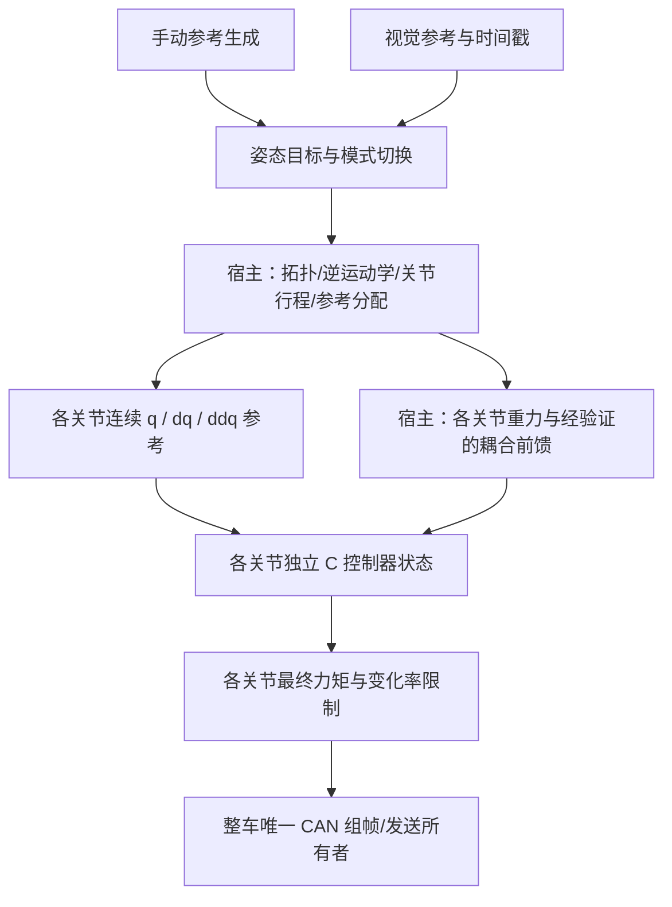

# 多轴接入：先分配关节参考，再运行独立控制器

本库的一个实例控制一个关节。Yaw/Pitch 各一实例是常见接法，也可以静态分配三个实例形成“一个 Yaw、两个 Pitch”或“两个 Yaw、一个 Pitch”的执行层。实例数不等于已完成该机械结构的耦合控制设计；当前三实例测试验证内存状态、故障隔离和角度助手，没有运行三轴耦合被控对象或实机验证。

## 两个层次分别负责什么

手瞄和自瞄都可接入同一组控制器。上层分别把摇杆/鼠标增量、视觉轨迹变为位置、速度、加速度一致的参考，并处理单位、源时间戳、连续性和模式切换。切换参考来源不代表允许电机自动使能，也不能借切换清除尚未处理的锁定故障。若复位后重新同步控制状态，首个有效周期仍为零输出 warmup。

关节控制必须使用该关节自己的反馈。对串联轴，把同一份末端世界姿态误差直接交给两个关节独立追踪，会使两个关节同时补偿同一误差，并破坏预期的参考分配。本库不决定谁负责大范围跟踪、谁负责小范围快速补偿，也不实现逆运动学、奇异位姿处理或整车姿态规划。

## 一个 Yaw、两个 Pitch

以两个串联俯仰关节为例，即使平面近似成立，末端俯仰也是底座倾角与两个关节角的组合。两个 Pitch 的机械角不同，靠近根部的关节还承受下游连杆、电机和负载的重力矩；其重力通常依赖两个关节的组合姿态，不能给两个关节都套同一个 `A*cos(world_pitch)+B*sin(world_pitch)`。

宿主应先明确机构拓扑、传动比、质量/重心与轴方向，再建立或辨识模型：

\[
M(q)\ddot q+C(q,\dot q)\dot q+g(q)+f(\dot q)=\tau.
\]

本库没有计算矩阵 M、科氏/离心项 C 或向量 g。各关节的标称惯量/阻尼与补偿项必须避免重复计入；动态耦合可能需要联合控制设计，不能仅靠扩大 ESO 带宽就认为已解决。

若已验证的上层模型能给出每个关节的已知负载，可分别调用 `yaw_controller_step_with_load()`。API 的符号约定是 `J*a = motor_torque - nominal_drag - known_load + residual`：当前负载进入总力矩限制和抗饱和之前；上一周期负载用于 ESO 预测；反馈中的可选已执行力矩仍是总电机力矩。耦合补偿采用参考还是测量、如何处理延时和上一周期保持，均需与宿主模型一致并单独验证。

`gimbal_controller_step()` 是为单轴平面 Pitch 提供的便利适配，其关节参考关系为 `q_joint_ref=q_joint+q_ref-q_feedback`。复杂串联结构应由上层完成关节空间分配和机械边界管理，再调用通用核心，不能把该单轴关系当作通用三维运动学。

## 两个 Yaw、一个 Pitch

常见分工是大 Yaw 负责连续转动，小 Yaw 在有限行程内快速修正。宿主应先分配两者参考，例如保持小 Yaw 在工作区内并逐步把持续偏差移交给大 Yaw；该策略的速度、加速度和再居中过程都需要连续化。本库没有内置这套分配器。

- 大 Yaw 的编码器/姿态累计值保持连续，不应无条件夹到 ±π。配置中的有效位置范围应适合实际连续坐标管理，不能照用教学仿真的有限角度范围。
- 小 Yaw 需要自己的机械零位、行程、参考内缩与上层制动轨迹；末端方向可达不意味着两个关节都在机械行程内。
- `gimbal_angle_near(target_rad, continuous_angle_rad, &result_rad)` 只将单圈**方向目标**提升到当前连续坐标附近的等价圈。例如当前 +179°、方向目标 -179° 得到约 +181°；恰好半圈时选择正向。
- 明确要求多转几圈的运动参考已经包含圈数，不能再经过最近圈助手。助手也不累计编码器、不分配两个 Yaw，不会替你把一个世界目标拆成两套关节目标。

长时间累计时需要由宿主管理浮点精度和坐标原点。若进行重定零点，应在受控的重置/重新同步阶段一致处理参考、反馈和模型状态；助手不能恢复已经在 float 中丢失的精度。

## 时序、实例与发送

每轴分配独立 `YawController` 或 `GimbalController`，以及各自的积分、ESO、负载历史、故障状态和应用力矩限值。多轴可以在同一控制任务中依次调用，但反馈快照应满足机械模型所需的一致时刻；一个轴的当前样本和另一个轴的过期样本不能组成可信耦合模型。

`Stm32GimbalPeriodic` 为每个轴提供回调式薄层。若多个轴共享 CAN 电流组，由唯一组帧所有者收集各槽的新鲜命令并统一发送，不要让各轴独立发送一帧并清空其他槽。应用还要决定一个轴故障时停止本轴还是停止整套机构；核心实例隔离不构成整机故障策略。

Pitch 零力矩不等于保持姿态。启动 warmup、故障和显式停机的零命令需要结合机械支撑、制动和上层恢复流程；软件关节范围检查也不是碰撞模型或制动规划。

## 本仓库已经验证的内容

`tests/test_multiaxis.c` 覆盖 -100..+100 圈附近的方向目标提升、非法角度拒绝和三个独立关节实例；故障注入一个实例不改变另外两个实例状态。`tests/test_gimbal_controller.c` 覆盖单轴重力/关节角分离、负载时序、限幅、复位与实例隔离。

性能数字来自独立的 [Yaw 报告](validation_report.md)与 [单轴 Pitch 报告](pitch_validation.md)。Pitch GM 开发组未通过预定性能门槛，该失败仍保留。三轴分配算法、关节间动态耦合、动态底座运动以及完整整车实时性均不在已验证性能范围内。
