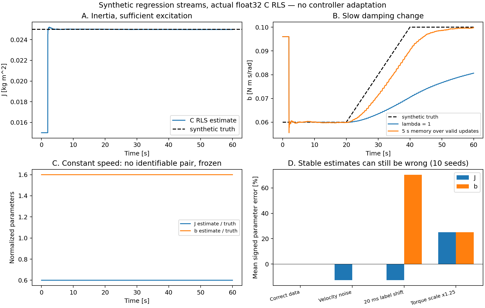

# 在线 RLS 合成回归验证

[实验工程与运行步骤](../../experimental/online_rls/README.md) · [辨识与整定](../../docs/system_identification.md) · [完整报告](report.json) · [实验条件](protocol.json) · [独立核对记录](verification.json)

本组结果来自实际 float32 C RLS 对合成积分回归流的逐窗口更新。**没有驱动电机，没有修改控制器增益，也没有验证控制闭环性能改善。** 正常组角度和速度是无噪声解析值，仅力矩积分标签添加独立噪声；反例另外破坏测量、标度或时序假设。

## 结果

| 条件 | 实际结果 | 结论范围 |
| --- | --- | --- |
| 正常数据，10 个种子 | 最终点最大绝对相对误差：J **0.0480%**、b **0.2615%** | 支持该合成条件下的参数恢复，不是实机精度 |
| C 与同先验批量 LS | 正常组最大归一化参数差 **1.30×10⁻⁶**；有遗忘组 **2.85×10⁻⁷** | 使用相同 float32 数据、先验和接受样本的数值等价检查 |
| b 在 20–40 秒缓慢变化 | 50–60 秒 MAE：无遗忘 **0.021237**，有限遗忘 **0.000660 N·m·s/rad** | 单独 seed=100 的一条轨迹，不能推广为多工况稳健跟踪 |
| 单向匀速，信息不足 | **0 次更新**，参数和 P 保持初值 | 正确冻结，不能称作辨识成功 |
| 42 个注入的无效标志、NaN、异常标签 | 全部拒绝，参数和 P 逐字节不变 | 检查本次输入保护与后续正常更新，不是完整板级故障验收 |
| 速度端点加噪声，10 个种子 | J 平均有符号误差 **−12.67%** | 回归量误差会让参数收敛到偏值 |
| 力矩标签相对运动错位 20 ms | J 平均 **−12.81%**，b 平均 **+70.46%** | 标签时间错位反例，不是延迟执行器闭环仿真 |
| 力矩标签比例为真实值的 1.25 | J、b 平均偏高约 **25%** | 数值检查无法代替物理标度核准 |



正常参数恢复、批量等价、慢漂及冻结检查的七项声明门槛通过。后三类失配反例完整保留，不能把“所有算法门槛通过”解释为所有数据条件下都能得到正确物理参数。

## 数据与复现

- [report.json](report.json)：44 条回归流的逐种子指标、汇总与构建来源；其中 40 条来自正常/三个失配组，另有两条漂移对照、秩不足和异常输入各一条。
- [protocol.json](protocol.json)：模型尺度、种子、窗口和门槛。本轮为可复现数值检查，没有独立盲测或预注册。
- [normal.csv](normal.csv)、[drift_no_forgetting.csv](drift_no_forgetting.csv)、[drift_forgetting.csv](drift_forgetting.csv)、[rank_deficient.csv](rank_deficient.csv)、[faults.csv](faults.csv)：5 条代表轨迹，共 15,000 行。
- [SVG 曲线](online_rls_checks.svg)：可编辑矢量版本。

在仓库根目录运行新实验，再校验**当次新结果**：

```bash
.venv/bin/python experimental/online_rls/run_experiments.py --output build/online-rls-results
.venv/bin/python tools/check_online_rls_results.py --report build/online-rls-results/report.json --output build/online-rls-verification.json
```

脚本会构建实际 C 库并记录哈希。校验器核对当次源码、库文件、固定实验条件、逐种子统计和 CSV；只修改报告的 pass 字段不能通过。发布目录保留的是归档结果，没有打包原共享库；不同编译器/平台的库哈希可能不同，应重新生成自己的报告。

激励前端当前位于 Python，C 只接收样本和激励标志。速度噪声反例没有给角度加入噪声，也没有单独模拟闭环相关噪声。有关持续激励、闭环辨识、参数采用条件和三轴坐标的限制，见 [模型辨识与整定](../../docs/system_identification.md)。
